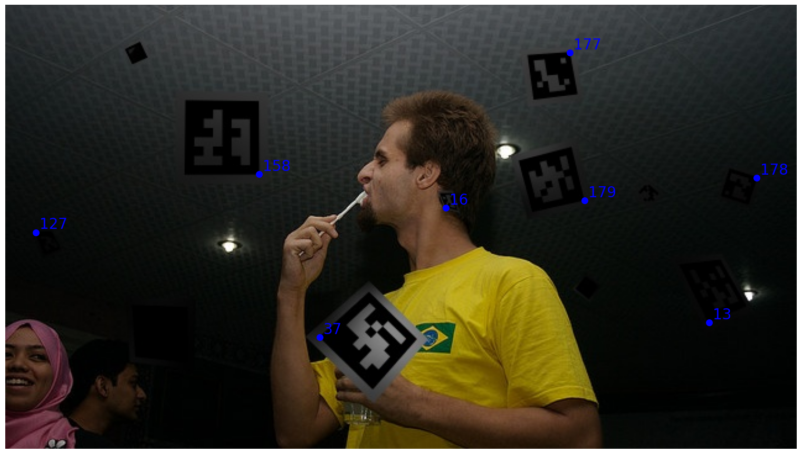

# ArUco Marker Detection Challenge

Computer Vision and Digital Image Processing — CO3057  
Ho Chi Minh University of Technology (HCMUT)

This project implements a hybrid Computer Vision + CNN pipeline for robust ArUco marker detection under challenging real-world conditions such as:

- extreme perspective distortion
- skewed / tilted markers
- motion blur
- low contrast
- shadows
- background clutter
- occlusion
- noise

The project was developed for the Kaggle competition:

https://www.kaggle.com/competitions/aruco-detection-challenge

<h2>Demo Image</h2>

<p align="center">
  
  
</p>

---

# Kaggle Result

Leaderboard:

https://www.kaggle.com/competitions/aruco-detection-challenge/leaderboard

## Best Result

| Rank | Name | Score |
|---|---|---|
| Top 3 | Nguyen Nhat Nam | 0.96757 |

The pipeline focuses heavily on:

- reducing false positives
- improving localization precision
- detecting difficult markers
- sacrificing runtime for higher accuracy

---

# Project Structure

```text
project/
│
├── data/
│   ├── aruco_data/
│   │   ├── train/
│   │   ├── test/
│   │   └── train.csv
│   │
│   └── train/
│       ├── real/
│       └── fake/
│
├── models/
│   ├── aruco_classifier_model_epoch50.keras
│   ├── Classification_CNN.ipynb
│   └── generate_dataset.py
│
├── notebooks/
│   ├── experiment.ipynb
│   └── generate_submission.ipynb
│
├── src/
│   ├── detector.py
│   ├── pipeline.py
│   ├── postprocess.py
│   ├── preprocess.py
│   └── utils.py
│
├── baseline.py
├── evaluate.py
├── submission.csv
├── requirements.txt
└── README.md
```

---

# Folder Description

## data/aruco_data/

Contains the original Kaggle dataset:

- training images
- testing images
- train.csv with ground truth annotations

---

## data/train/

Dataset used to train the CNN classifier.

Structure:

```text
real/  -> real markers
fake/  -> fake candidates / distractors / noise
```

The CNN is used to filter candidate regions after OpenCV detection.

---

## models/

Contains:

- trained CNN models
- CNN training notebook
- dataset generation scripts

---

## notebooks/

### experiment.ipynb

Used for:

- augmentation experiments
- debugging
- local score evaluation
- visualization of failure cases

### generate_submission.ipynb

Used to generate Kaggle submission CSV files.

---

## src/

Contains the main pipeline implementation.

---

### preprocess.py

Generates multiple augmented views of the image:

- CLAHE
- gamma correction
- adaptive threshold
- invert
- sharpen
- normalize
- morphology
- blur
- contrast enhancement

Goal:

```text
increase recall of cv2.aruco.detectMarkers()
```

---

### detector.py

Responsible for:

- candidate detection from multiple augmentations
- candidate merging
- duplicate clustering

Priority:

```text
Recall >>> Precision
```

---

### postprocess.py

Contains:

- CNN filtering
- ROI refinement
- strict ArUco decoding
- perspective normalization

This stage is the main component for reducing false positives.

---

### pipeline.py

Full detection pipeline:

```text
Original image
→ augmentation
→ candidate detection
→ CNN filtering
→ ROI refinement
→ strict decoding
→ merge results
→ output prediction string
```

---

# Main Idea

The pipeline uses a **multi-view detection strategy**.

Instead of detecting markers on only one image, the system generates many augmented versions:

- brighter
- darker
- sharpened
- thresholded
- inverted
- CLAHE-enhanced
- upscaled
- morphology-enhanced

Then:

```python
cv2.aruco.detectMarkers(...)
```

is applied to all versions.

Goal:

```text
reduce missed detections
```

---

# CNN Filtering

Because multi-view augmentation creates many false positives, a CNN classifier is used to:

- keep real markers
- remove fake markers

The CNN is trained on:

```text
real vs fake marker patches
```

---

# ROI Refinement

After CNN verification:

- crop ROI
- add padding
- perspective normalization
- upscale ROI
- generate enhanced ROI variants

Then:

```python
cv2.aruco.detectMarkers(...)
```

is applied again for more reliable decoding.

This stage is especially effective for:

- heavily tilted markers
- small markers
- blurry markers
- shadowed markers

---

# Evaluation Metric

The competition metric rewards:

- correct marker IDs
- accurate localization
- fewer spam predictions

and strongly penalizes:

- false positives
- duplicate detections
- wrong IDs

Therefore, the pipeline is designed with:

```text
Precision > Runtime
```

instead of real-time performance.

---

# Installation

```bash
pip install -r requirements.txt
```

---

# Running the Pipeline

```bash
python baseline.py
```

or use:

```text
notebooks/generate_submission.ipynb
```

to generate submission files.

---

# Submission Format

```text
image_id,prediction_string
```

Example:

```text
000000000089,"29 481.785 261.833 102 273.434 321.559"
```

Where:

```text
id x y
```

represents:

- marker ID
- top-left corner coordinates